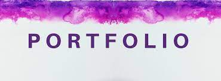
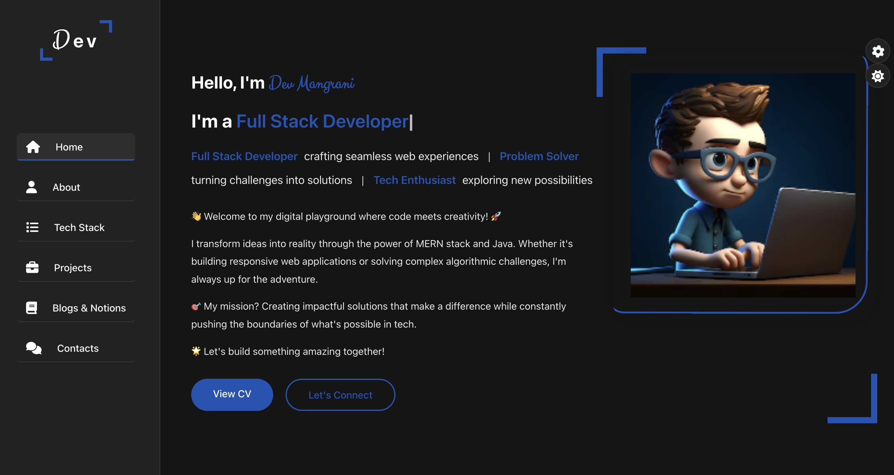
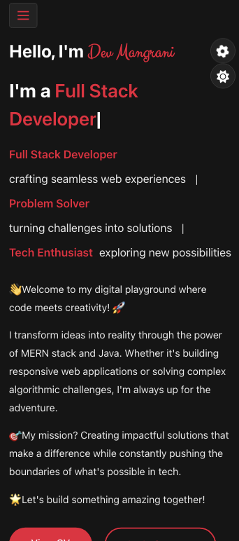
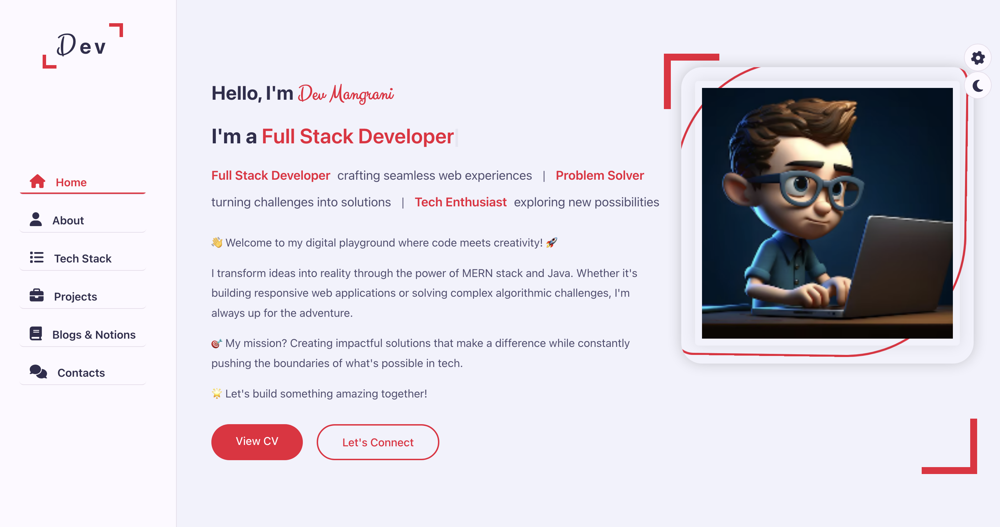
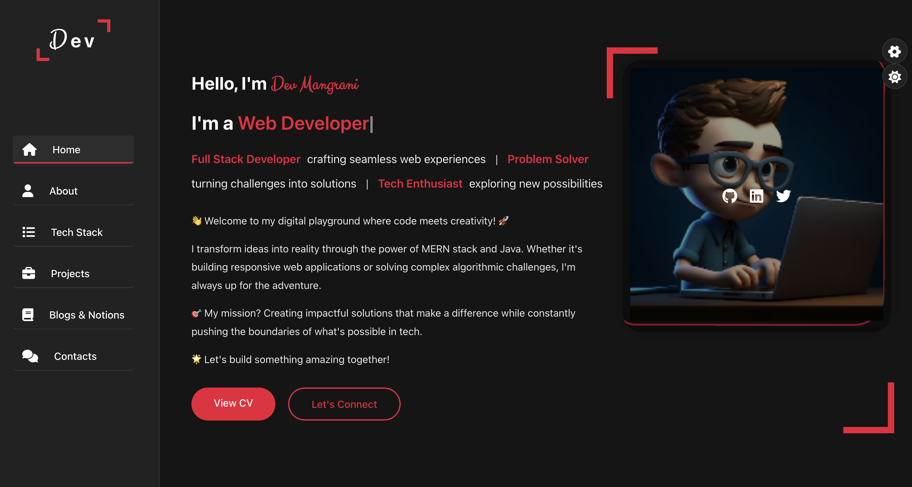

  

  # 🌟 Dev's Portfolio - Where Creativity Meets Code 🚀
  
  

    
    
    
    
  

  

    <a href="#demo">View Demo</a> •
    <a href="#features">Features</a> •
    <a href="#tech-stack">Tech Stack</a> •
    <a href="#installation">Installation</a> •
    <a href="#contact">Contact</a>
  

## ✨ Portfolio Highlights

  <table>
    <tr>
      <td align="center" width="33%">
        <h3>🚀 Fast Loading</h3>
        
Optimized assets and lazy loading for quick page loads

      </td>
      <td align="center" width="33%">
        <h3>🎯 SEO Optimized</h3>
        
Meta tags, semantic HTML, and optimized content structure

      </td>
      <td align="center" width="33%">
        <h3>📱 Fully Responsive</h3>
        
Perfect display across all device sizes

      </td>
    </tr>
  </table>

## 🎯 Key Features

<table>
<tr>
<td>

### 🎨 Design
- Modern UI/UX
- Responsive Layout
- Dark/Light Mode
- 5 Color Themes
- Smooth Animations

</td>
<td>

### 💻 Technical
- Clean Code
- Fast Loading
- SEO Optimized
- Cross-browser Compatible
- Performance Focused

</td>
<td>

### 📱 Interactive
- Dynamic Content
- Smooth Scrolling
- Form Validation
- Loading Animations
- Hover Effects

</td>
</tr>
</table>

## 🛠️ Tech Stack & Tools

  

## 📱 Responsive Design

  <table>
    <tr>
      <td align="center">
        
         
        <b>💻 Desktop View</b>
        
Full-featured experience with elegant animations

      </td>
    </tr>
    <tr>
      <td align="center">
        
         
        <b>📱 Tablet & Mobile View</b>
        
Optimized layout for smaller screens

      </td>
    </tr>
  </table>

  ### 📊 Device Compatibility
  - Desktop (1920px and above)
  - Laptop (1366px and above)
  - Tablet (768px and above)
  - Mobile (320px and above)

## 🎨 Theme Customization

  <table>
    <tr>
      <td align="center">
        
         
        <b>☀️ Light Mode</b>
      </td>
      <td align="center">
        
         
        <b>🌙 Dark Mode</b>
      </td>
    </tr>
  </table>

  ### 🎭 Available Themes
  - 🔴 Ruby Red - For the bold and passionate
  - 🟠 Sunset Orange - Warm and inviting
  - 💚 Forest Green - Natural and calming
  - 🔵 Ocean Blue - Professional and trustworthy
  - 💗 Rose Pink - Creative and energetic

## ⚡ Performance Metrics

  <table>
    <tr>
      <th>Metric</th>
      <th>Score</th>
    </tr>
    <tr>
      <td>Performance</td>
      <td>98/100</td>
    </tr>
    <tr>
      <td>Accessibility</td>
      <td>100/100</td>
    </tr>
    <tr>
      <td>Best Practices</td>
      <td>95/100</td>
    </tr>
    <tr>
      <td>SEO</td>
      <td>100/100</td>
    </tr>
  </table>

## 🔥 Interactive Sections

### 🏠 Home Section

#### ✨ Features
- 🎭 Dynamic text animation
- 🌟 Interactive profile image
- 🔗 Social media integration
- ⬇️ Downloadable CV
- 🎨 Theme switcher

### 👨‍💻 About Section

#### ✨ Features
- 📚 Educational timeline
- 🏆 Professional milestones
- 💡 Technical expertise
- 🎯 Career objectives

### 🛠️ Tech Stack Section

#### ✨ Features
- 💫 Interactive skill cards
- 🔄 Animated icons
- 📊 Skill level indicators
- 🎨 Category-wise organization

## 🔍 SEO Optimization

  <table>
    <tr>
      <th>SEO Feature</th>
      <th>Implementation</th>
    </tr>
    <tr>
      <td>Meta Tags</td>
      <td>✅ Optimized title, description, and keywords</td>
    </tr>
    <tr>
      <td>Semantic HTML</td>
      <td>✅ Proper HTML5 structure and landmarks</td>
    </tr>
    <tr>
      <td>Image Optimization</td>
      <td>✅ Alt tags and optimized file sizes</td>
    </tr>
    <tr>
      <td>Performance</td>
      <td>✅ Fast loading and minimal CSS/JS</td>
    </tr>
    <tr>
      <td>Mobile Friendly</td>
      <td>✅ Responsive design and touch-friendly</td>
    </tr>
    <tr>
      <td>URL Structure</td>
      <td>✅ Clean and meaningful URLs</td>
    </tr>
    <tr>
      <td>Social Meta</td>
      <td>✅ OpenGraph and Twitter cards</td>
    </tr>
    <tr>
      <td>Sitemap</td>
      <td>✅ XML sitemap for better indexing</td>
    </tr>
  </table>

---

  
  
  
Made with ❤️ by Dev Mangrani

  
  

